# Discord boti loomine

## Discordi konto loomine (kui pole veel seda)
Selleks, et boti luua, peab olema discordi konto, selle tegemiseks mine lehele [https://discord.com/register](https://discord.com/register).  
Konto kasutajanimeks võid kasutada ükskõik mida (ei pea olema sinu päris nimi).  
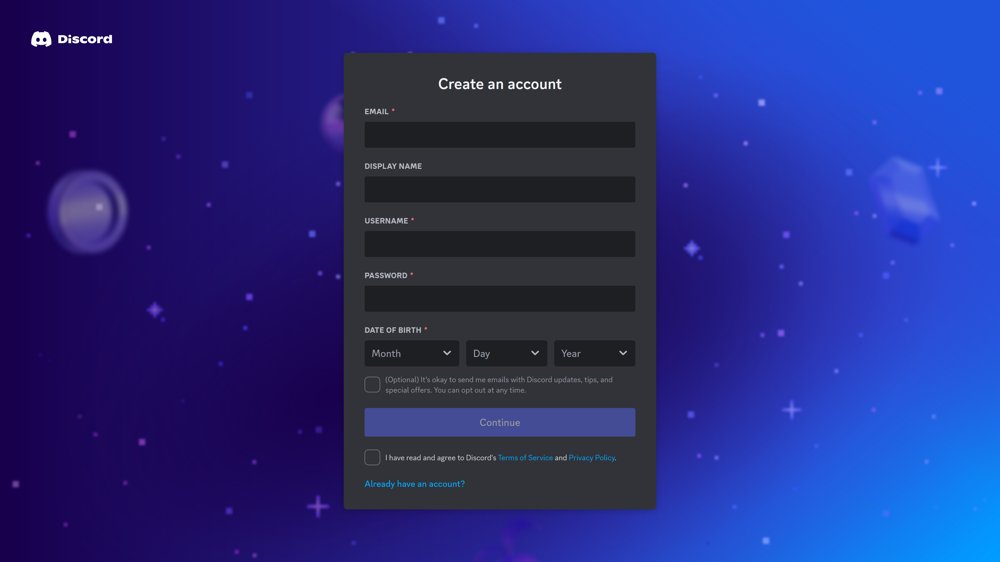  

## Boti loomine ja kutsumine serverisse
Ühine Boti töötoa serveriga: [https://discord.gg/azW56CWK](https://discord.gg/azW56CWK)

Loo servrisse UnoBot sektsiooni alla uus kanal, kuhu paned ka emoji või sümboli millega boti välja kutsuma hakkad (siis ei hakka teiste botid teile vastama)  
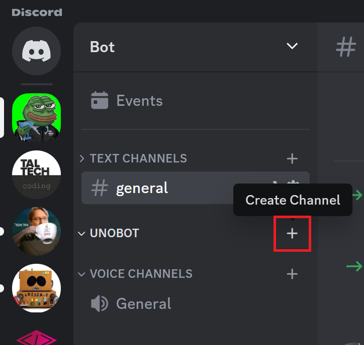
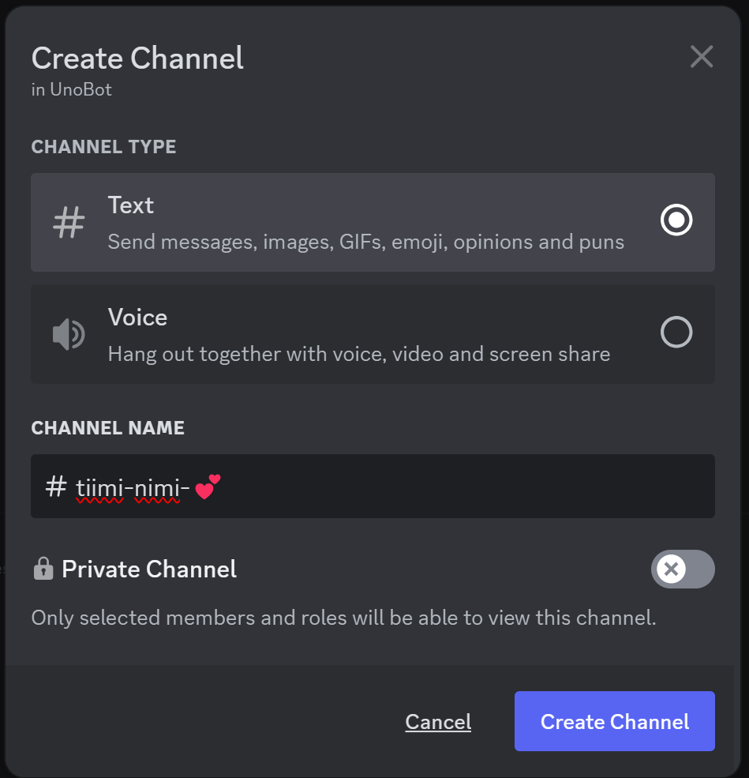

Mine lehele [https://discord.com/developers/applications](https://discord.com/developers/applications) ning loo uus rakendus <kbd>New Application</kbd>.  
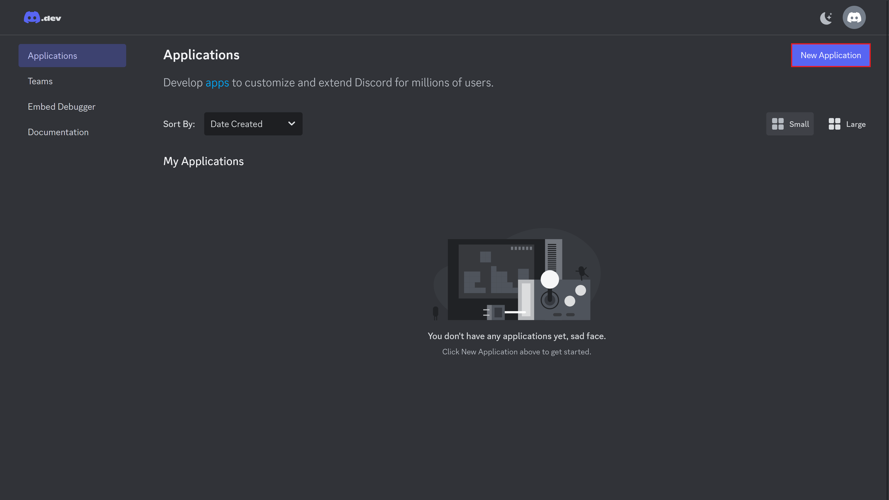  
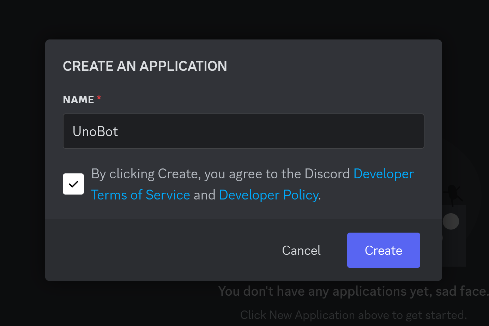  

Liigu **OAuth2** menüüsse ning **OAuth2 URL Generator** alt vali <kbd>bot</kbd>.  
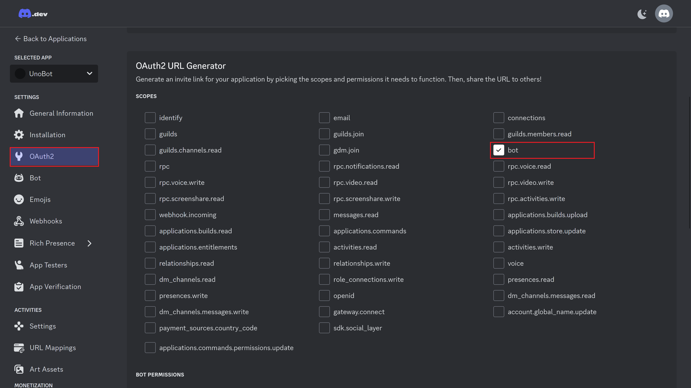

Õiguste alt ei pea valima midagi, vaid keri alla ning kopeeri loodud link.  
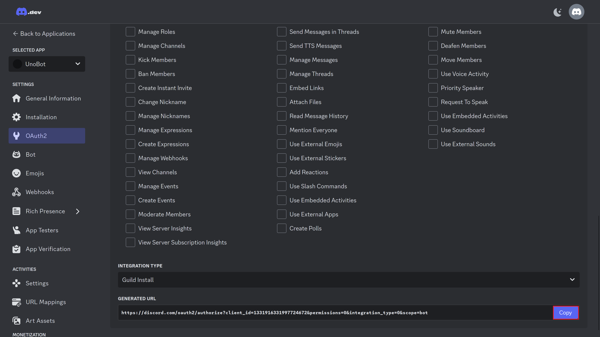

Nüüd mine sellele lingile ning vali, millisesse serverisse sa boti kutsuda tahad, seejärel vajuta <kbd>Continue</kbd> ning <kbd>Authorize</kbd>.
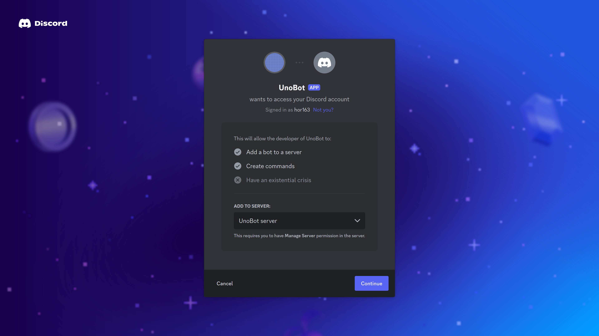

Seejärel on bot serverisse lisatud ning ta on offline (peabki olema).  
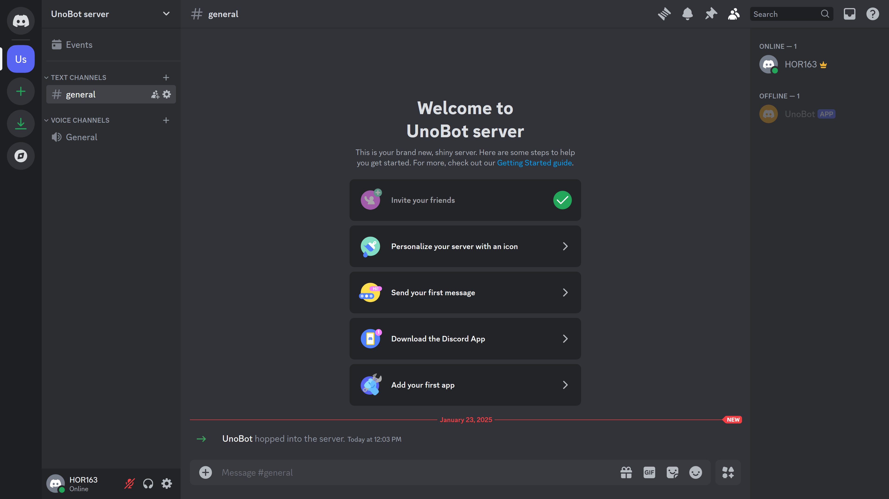

## Õiguste andmine botile

Liigu vasakul menüüs <kbd>Bot</kbd> alla, keri natuke allapoole ning lülita sisse **PRESENCE INTENT**, **SERVER MEMBERS INTENT**, **MESSAGE CONTENT INTENT** ning vajuta <kbd>Save Changes</kbd>  
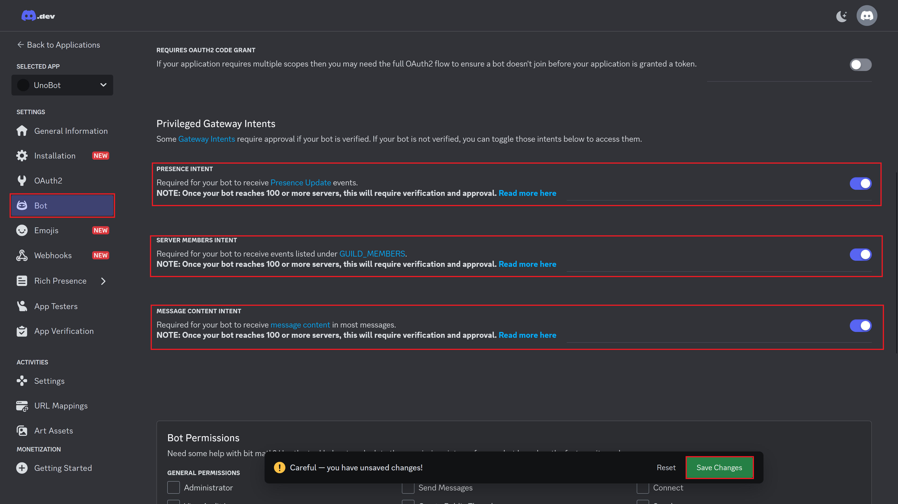  

## Tokeni loomine botile

Selleks, et boti kasutada saaks, tuleb kuidagi temaga suhelda. Token on nagu emaili aadress: kui sa tead boti tokenit, siis saad talle korraldusi saata. Seega mine <kbd>Bot</kbd> alla ning vajuta <kbd>Reset Token</kbd>.
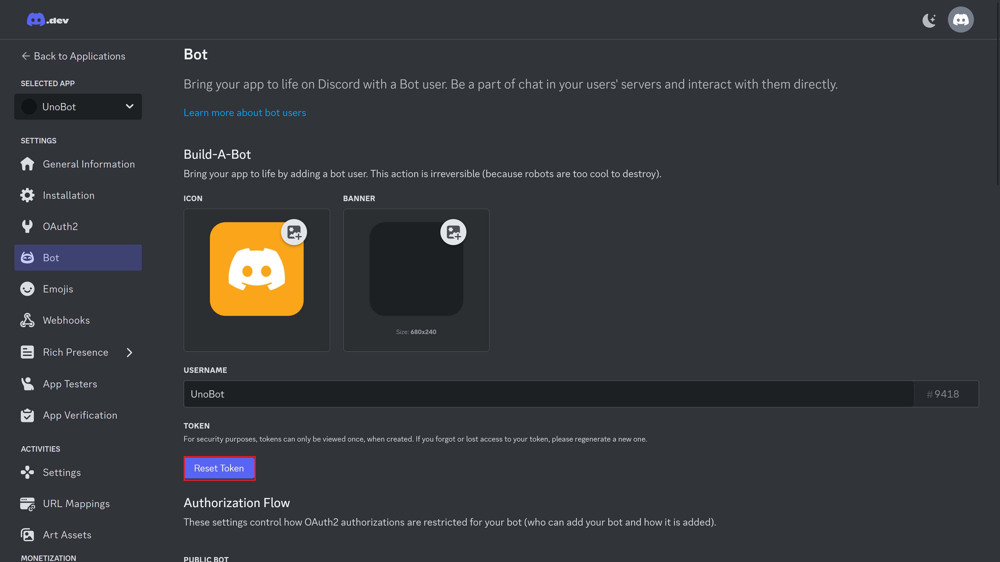  

Token-i resettimise käigus küsib discord parooli (või mingit muud autentimisviisi), see on normaalne.  

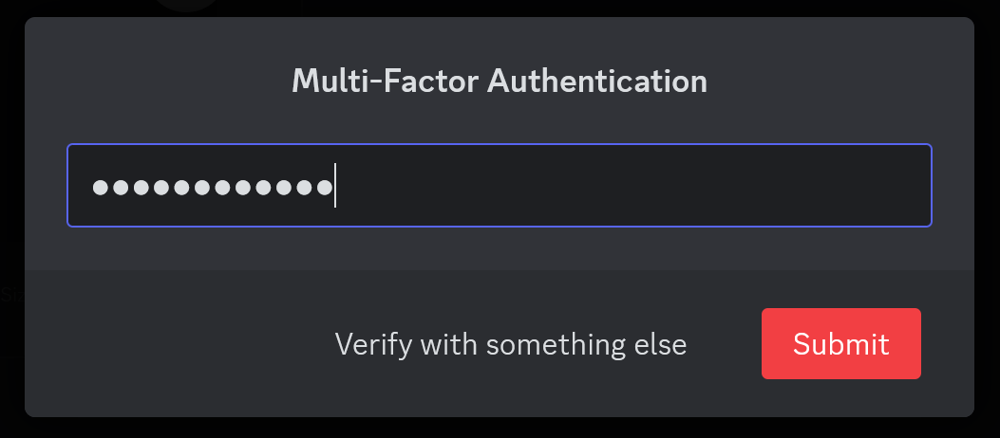

Kopeeri token (see on see pikk numbrite, tähtede ning sümbolite jada) ning aseta see kuskile turvalisse kohta (näiteks notepadi), sest seda läheb hiljem tarvis.  
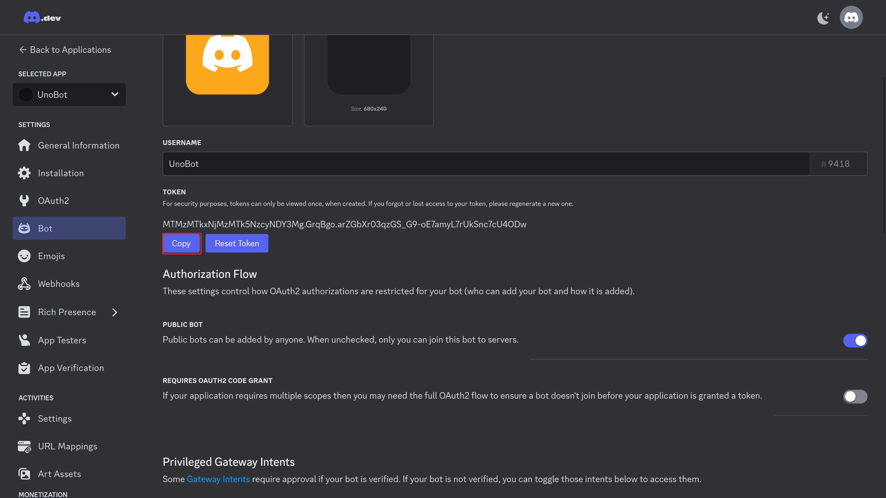  

## Edasised sammud
Järgmine samm on katsetada seda et token ning bot töötavad, selle jaoks liigu järgnevale lingile ning järgi juhiseid: https://github.com/anpeep/uno-pygame  
Peale seda unobotiga mängimist saab luua endale lihtsat chatboti: https://github.com/taltech-coding/discord-bot

