# Discord boti loomine

| Sisukord | |
-----------|--------------
| [Koodi allalaadimine](#githubi-repo-allalaadimine) | Koodi alla laadimise jaoks ei ole vaja GitHubi kontot |
| [Discordi konto loomine](#discordi-konto-loomine-kui-sul-pole-veel-seda) | Kui sul on juba discordi konto, siis võid selle vahele jätta (peaasi et parooli tead või mingil muul moel saad sisse) |
| [Boti loomine](#Boti-loomine) |  
| [Discordi serveri loomine](#discordi-serveri-loomine) | _Ilmselt pole vaja_ |
| [Boti kutsumine serverisse](#boti-kutsumine-serverisse) |
| [Boti jooksutamine (ellu äratamine)](#boti-ellu-äratamine-ehk-koodi-jooksutamine) |

## Githubi repo allalaadimine
Selleks, et kood alla laadida vajuta selle lehe ülaosas olevale rohelisele nupule "_Code_"
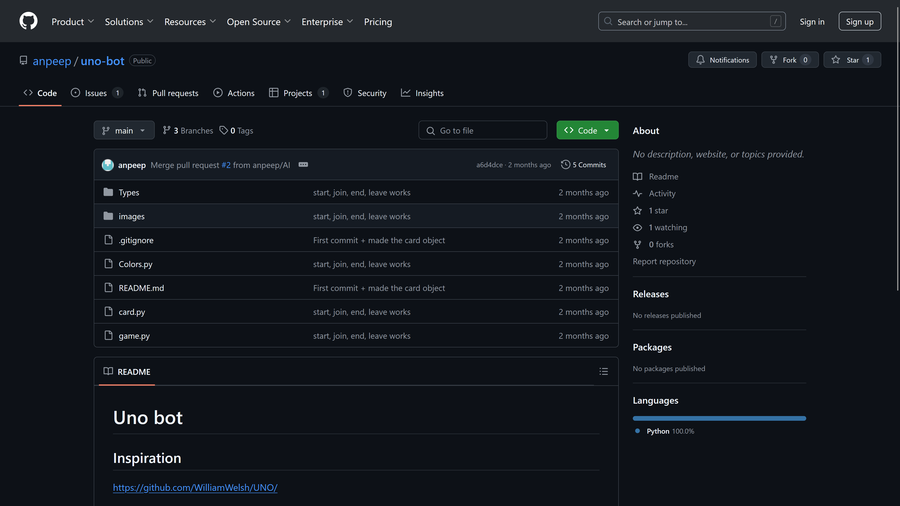  
Variant 1. HTTPS-iga alla laadimine  
Seejärel vali HTTPS ning kopeeri link.
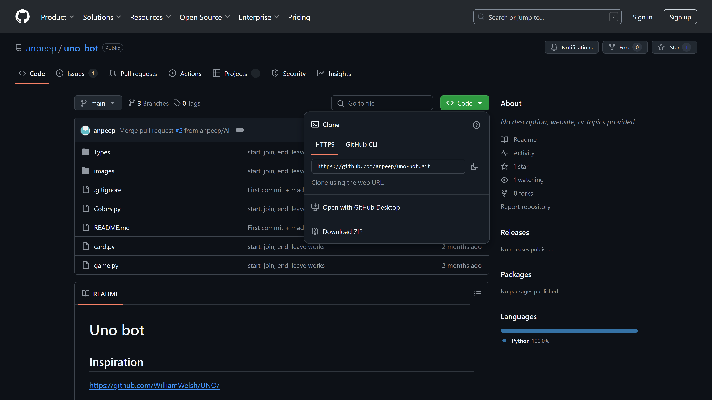
Ava PyCharm otsides menüüst PyCharmi.  
<!-- Lingi sees on  selleks et link ei oleks aktiivne  -->
Kui PyCharmi litsentsi on vaja aktiveerida, siis vali _License server_ ning kopeeri **http://license1.intra.ttu.ee:1111** serveri aadressi alla.
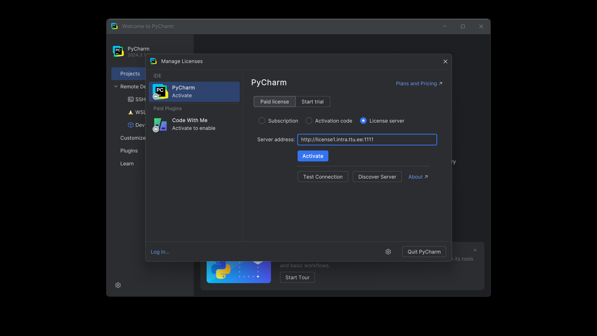

<b>Kui Gitiga allalaadimine ebaõnnestub</b>

<!-- Variant 2. ZIP-iga alla laadimine   -->
Seejärel vali "_Download ZIP_"
  
Nüüd kui kood on alla laetud mine allalaetud failide kausta ning paki ZIP fail lahti (Parem klõps ja _extract all..._)
[ZIP faili lahti pakkimine](images/4_cropped.png "ZIP faili lahti pakkimine")  
Nüüd kui see tehtud, siis ava PyCharm ning 

### `pole PyCharmi seega pole hetkel edasi teinud.`

## Discordi konto loomine (kui sul pole veel seda)
Selleks, et boti luua, peab olema discordi konto, selle tegemiseks mine lehele [https://discord.com/register](https://discord.com/register).  
Konto kasutajanimeks võid kasutada ükskõik mida (ei pea olema sinu päris nimi).
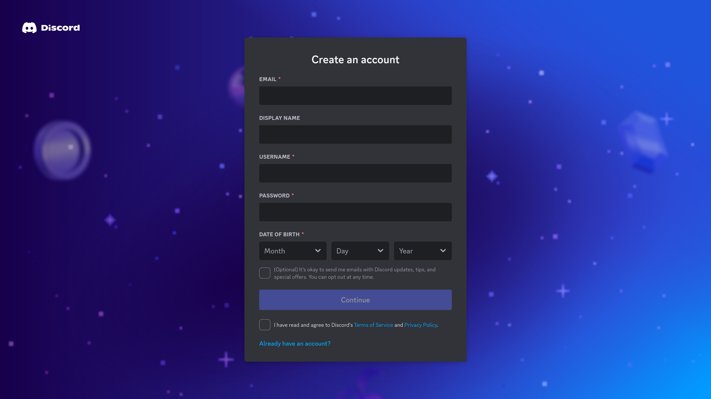

## Boti loomine
Mine lehele [https://discord.com/developers/applications](https://discord.com/developers/applications) ning loo uus rakendus (_New Application_).  
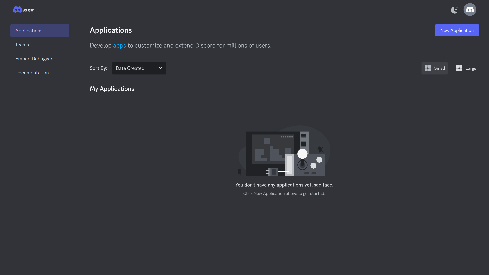
Anna enda botile mingi nimi.  
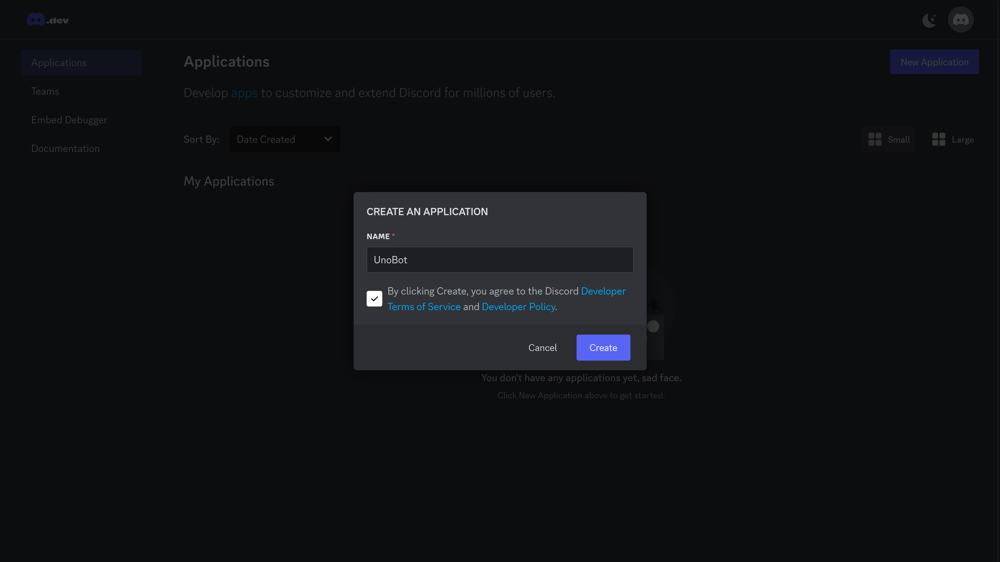

Selleks, et boti kasutada saaks, tuleb temale juurdepääs saada. Selleks on vaja boti tokenit. Seega mine "Bot"-i alla ning vajuta "Reset Token".
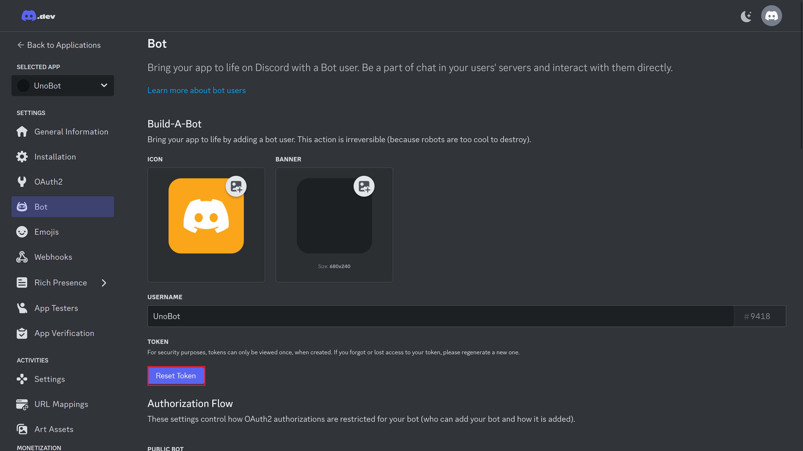  

Token-i resettimise käigus ilmselt küsib discord parooli, see on normaalne. Nüüd kopeeri token (see on see pikk numbrite, tähtede ning sümbolite jada).  
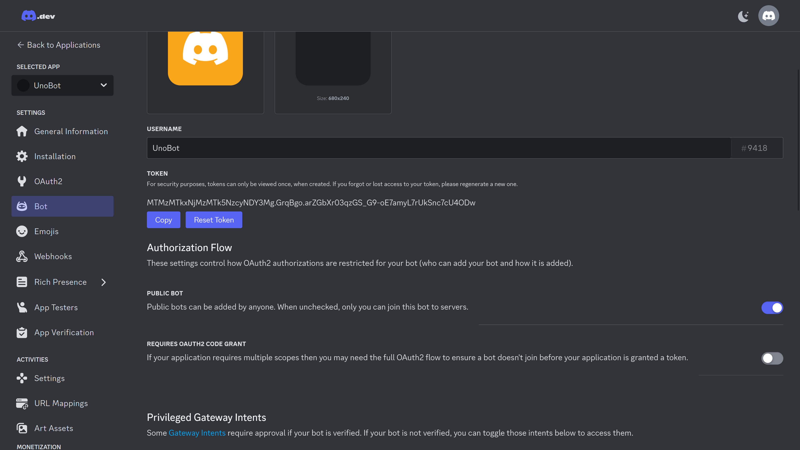 

Nüüd mine oma projekti alla ning aseta see token **Ilmselt tuleb kuhugi eraldi faili**  
**Boti token:** _MTMzMTkxNjMzMTk5NzcyNDY3Mg.GrqBgo.arZGbXr03qzGS_G9-oE7amyL7rUkSnc7cU4ODw_

Nüüd on bot valmis ning töökorras, kuid selleks et tema tegevusi ka kuskil näha, tuleb ta kutsuda serverisse.

## Discordi serveri loomine  
_Ilmselt ei lähe vaja ju?_  

Selleks mine tagasi discordi ning vajuta suurt plussi vasakul servas.  
Peale seda vali, et teed serveri enda jaoks (_Create My Own_) ning see on ainult sulle endale ja sõpradele (_For me and my friends_).  
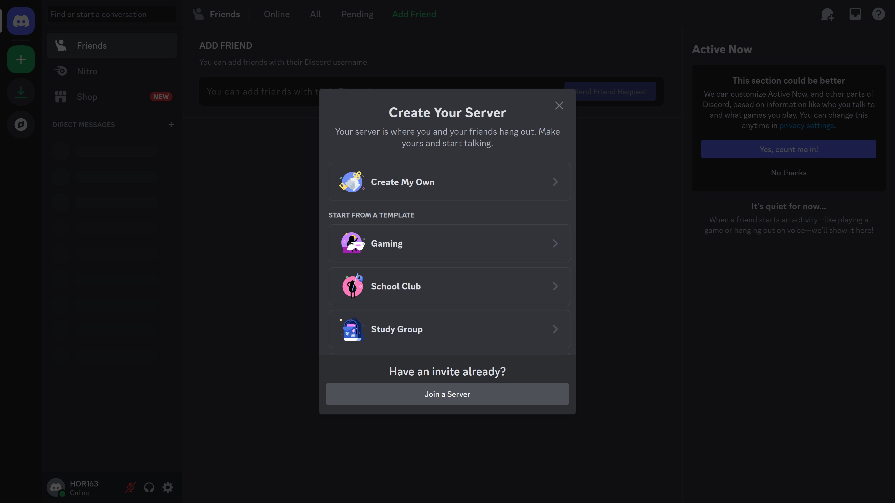
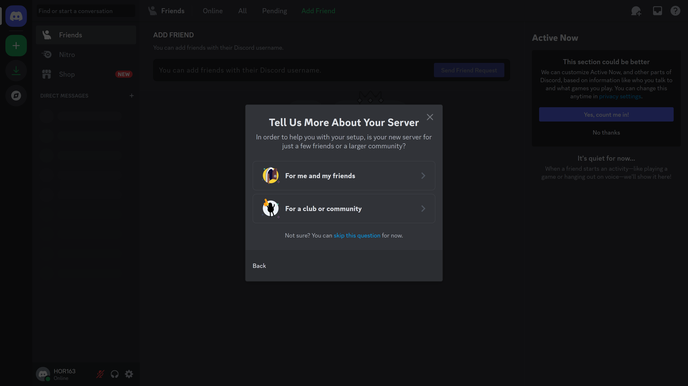

Vali serverile mingi nimi (võid ka pildi panna, aga see ei ole oluline)  
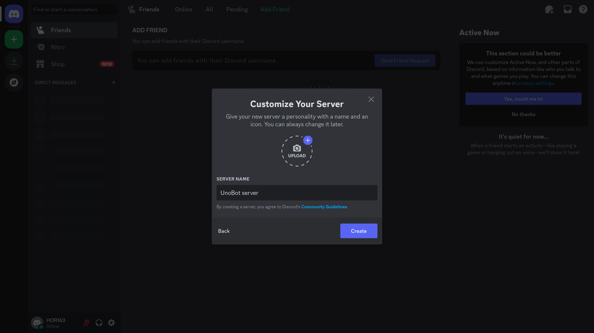

Nüüd on server valmis  
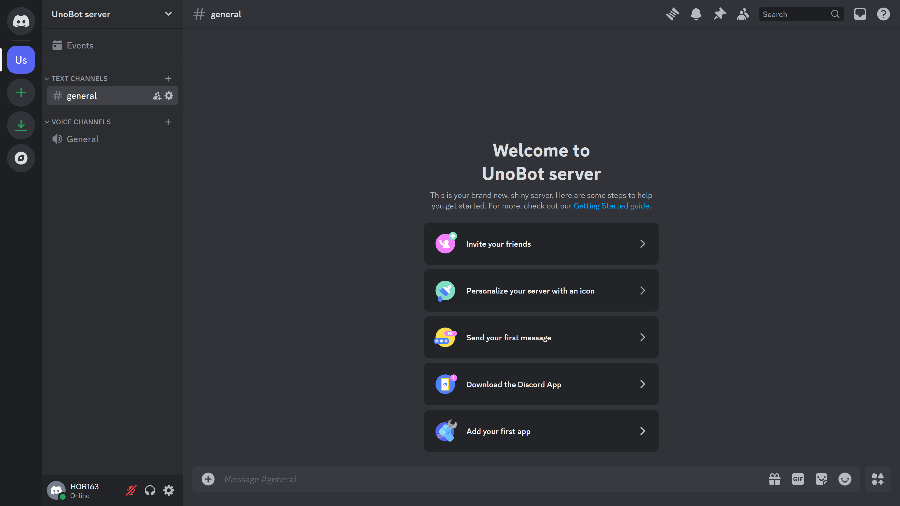

## Boti kutsumine serverisse
Mine enda boti lehele [https://discord.com/developers/applications](https://discord.com/developers/applications).  

See järel mine OAuth2 alla ning OAtuh2 URL Generator alt vali "bot".
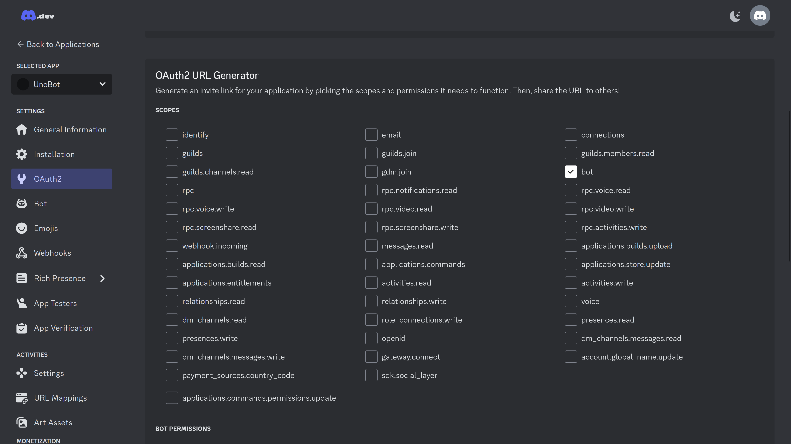

Ning õiguste alt vali "Administrator" ning kopeeri genereeritud URL.
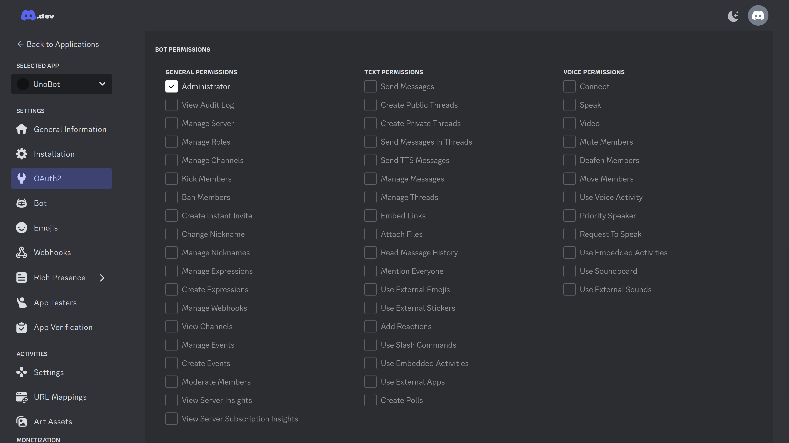
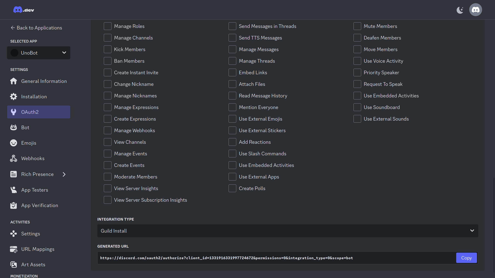  
** Boti link:** https://discord.com/oauth2/authorize?client_id=1331916331997724672&permissions=8&integration_type=0&scope=bot

Nüüd mine kopeeritud linigle nign vali, millisesse serverisse sa boti kutsuda tahad, seejärel vajuta _Continue_ ning _Authorize_.
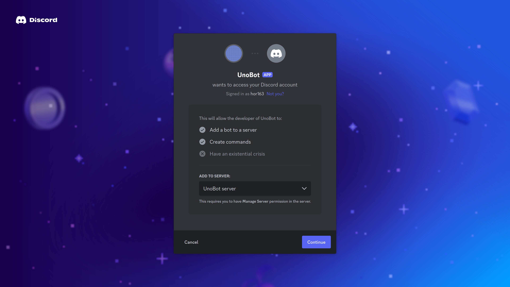

Seejärel on bot sinu serverisse lisatud, kuid ta on offline.  
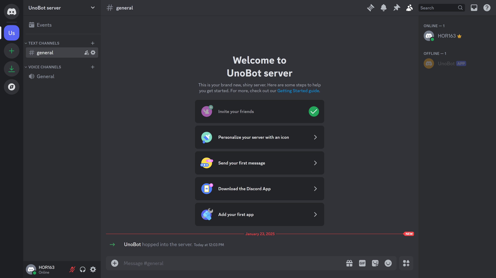

## Boti ellu äratamine ehk koodi jooksutamine
Leia üles Pycahrmis [main.py] ning üleval paremas nurgas vajuta rohelist noolekest. Nüüd peaks bot ka discorid serveris online olema ning botile saab hakata ksklusi andma läbi discordi.
