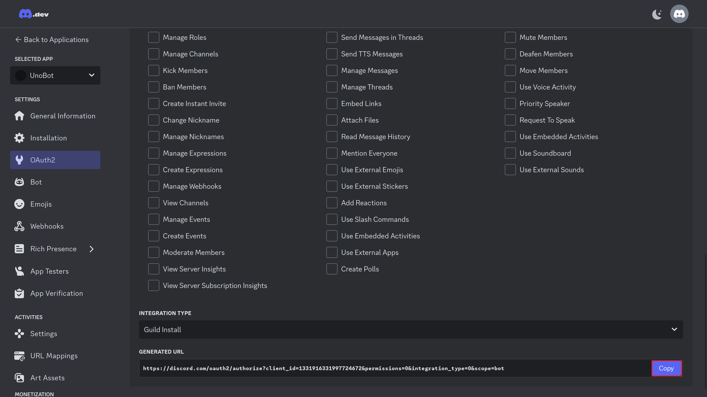

# Discord boti loomine

| Sisukord | |
-----------|--------------
| [Koodi allalaadimine](#githubi-repo-allalaadimine) | Koodi alla laadimise jaoks ei ole vaja GitHubi kontot |
| [Discordi mooduli allalaadimine](#discordi-mooduli-alla-laadimine) | |
| [Discordi konto loomine](#discordi-konto-loomine-kui-sul-pole-veel-seda) | Kui sul on juba discordi konto, siis võid selle vahele jätta (peaasi et parooli tead või mingil muul moel saad sisse) |
| [Discordi serveri loomine](#discordi-serveri-loomine) | _<span style="color:red">Ilmselt pole vaja</span>_ |
| [Boti loomine](#Boti-loomine) |  
| [Boti kutsumine serverisse](#boti-kutsumine-serverisse) |
| [Boti jooksutamine (ellu äratamine)](#boti-ellu-äratamine-ehk-koodi-jooksutamine) |


## Githubi repo allalaadimine
Selleks, et kood alla laadida vajuta selle lehe ülaosas olevale rohelisele nupule 
  

Seejärel vali HTTPS ning kopeeri link.

Ava PyCharm.  
Kui PyCharm küsib litsentsi aktiveerimist, siis vali <kbd>License server</kbd> ning aseta antud link serveri aadressi alla.
```
http://license1.intra.ttu.ee:1111
```


Kui see on tehtud, siis peaks avanema projekti avamise vaade  Sealt vali <kbd>Clone Repository</kbd>.


Peale seda aseta link, mille GitHubist kopeerisid ning vajuta <kbd>Clone</kbd>


PyCharm ilmselt küsib, kas usaldada antud projekti, vajuta <kbd>Trust Project</kbd>.


Kui kõik läks hästi, siis peaks kood olema alla laetud ning seda peaks olema näha (alselt peaks olema avataud õpetuse faili (`readme.md`), kuid vasakul paneelil saate failides ning kaustades sorada).


<details>
  <summary><b>Kui GITiga (lingiga ehk HTTPS) allalaadimine ebaõnnestub</b></summary>  

  Kui GITiga allalaadimine ebaõnnestus, siis võib ka ZIP failina koodi alla laadida. Selleks vali <kbd>Download </kbd>
    
  Nüüd kui kood on alla laetud mine allalaetud failide kausta ning paki ZIP fail lahti (Parem klõps ja <kbd>extract all...</kbd>)
    
  Nüüd kui see tehtud, siis ava PyCharm ning projektide alt vali <kbd>Open</kbd>
  
  Leia üles kaust, kuhu te failid lahti pakkisite ning avage see.
  
  Jällegi, vajutage, et usaldate projekti.
  
</details>


## Discordi mooduli alla laadimine
Selleks et meie kood saaks discordiga suhelda on head arendajad loonud python'i jaoks mooduli, mille abil saab discordi boti programmeerida. Kuna antud moodul pole veel alla laetud, siis peate te seda ise tegema.
Selleks avage PyCharmis terminal (vasakus all servas).

Peale seda asetage järgnev rida terminali ning vajutage <kbd>Enter</kbd>.
```bash
pip install discord
```


Peale seda peaksid punased jooned _game.py_ faili ülaosast kaduma (kui ei kao, siis kutsuge juhendaja).


## Discordi konto loomine (kui sul pole veel seda)
Selleks, et boti luua, peab olema discordi konto, selle tegemiseks mine lehele [https://discord.com/register](https://discord.com/register).  
Konto kasutajanimeks võid kasutada ükskõik mida (ei pea olema sinu päris nimi).


## Discordi serveri loomine  
Selleks mine tagasi discordi ning vajuta suurt plussi vasakul servas.  
Peale seda vali, et teed serveri enda jaoks <kbd>Create My Own</kbd> ning see on ainult sulle endale ja sõpradele (<kbd>For me and my friends</kbd>).  


Vali serverile mingi nimi (võid ka pildi panna, aga see ei ole oluline)  


Nüüd on server valmis  


## Boti loomine
Mine lehele [https://discord.com/developers/applications](https://discord.com/developers/applications) ning loo uus rakendus <kbd>New Application</kbd>.  

Anna enda botile mingi nimi.  


Selleks, et boti kasutada saaks, tuleb temale juurdepääs saada. Selleks on vaja boti tokenit. Seega mine <kbd>Bot</kbd> alla ning vajuta <kbd>Reset Token</kbd>.
  

Token-i resettimise käigus ilmselt küsib discord parooli, see on normaalne. Nüüd kopeeri token (see on see pikk numbrite, tähtede ning sümbolite jada).  
 

Nüüd mine oma projekti alla ning aseta see token **KUSKILE (ilmselt mingi eraldi fail token'i jaoks)**  
Näiteks võib token välja näha nagu midagi sellist: _MTMzMTkxNjMzMTk5NzcyNDY3Mg.GrqBgo.arZGbXr03qzGS_G9-oE7amyL7rUkSnc7cU4ODw_

Keri veel natuke allapoole ning lülita sisse _MESSAGE CONTENT INTENT_  
  
Kindlasti salvesta ka muudatused.  
<details>

  <summary><b>Mis on intent?</b></summary>

  Intent on discordis eraldi viis kuidas botiga suhelda. Näiteks kui bot on kuskil kanalis, saab bot ainult sulle saata sõnumi, nii et teised seda sõnumit ei näe. Kuna uno mängus teised ei tohi su kaarte näha, siis on see väga hea viis enda kaartide nägemiseks.
  

</details>

Nüüd on bot valmis ning töökorras, kuid selleks et temast asja oleks, tuleb ta kutsuda serverisse.


## Boti kutsumine serverisse
Mine enda boti lehele [https://discord.com/developers/applications](https://discord.com/developers/applications).  

See järel mine OAuth2 alla ning OAuth2 URL Generator alt vali <kbd>bot</kbd>.


Õiguste alt ei pea valima midagi, vaid keri alla ning kopeeri link kopeeri genereeritud URL.
<!--  -->
  


Nüüd mine kopeeritud lingile ning vali, millisesse serverisse sa boti kutsuda tahad, seejärel vajuta <kbd>Continue</kbd> ning <kbd>Authorize</kbd>.


Seejärel on bot sinu serverisse lisatud, kuid ta on offline.  


## Boti ellu äratamine ehk koodi jooksutamine
Selleks, et koodi käivitada, peab kõigepealt üles leidma faili, mida me käivitada tahame. Antud projektis on selle faili nimi `game.py`.

Seejärel vajuta üleval paremas servas olevat rohelist noolekest (kolmnurk, mis on rohelisest putukast vasakul pool).
